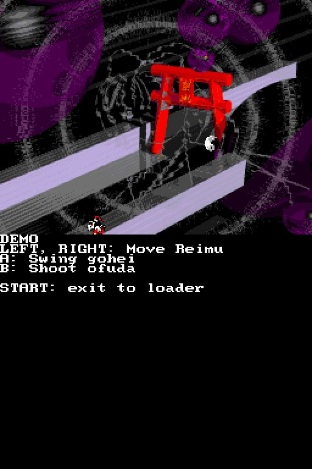

# Touhou Reiiden ~ The Highly Responsive to Prayers - DS port

## Overview

This project aims to port Touhou Reiiden (東方靈異伝　～ The Highly Responsive to Prayers) to the Nintendo DS, based on the game's fully decompiled source code at [ReC98](https://github.com/nmlgc/ReC98).

## How to build

The following are required to build the project:

* GCC and C++
* Python 3
* The Wonderful Toolchain package manager [(instructions here)](https://wonderful.asie.pl/wiki/doku.php?id=getting_started)
* The blocksds-toolchain package, from the blocksds repo
* Extracted files from HRtP

Place all the extracted HRtP files into /assets; if you have the game as an .hdi file, you can extract the files using tools like [98ripper](https://gitlab.com/bunnylin/98ripper). **Make sure that among them there's a file named *東方靈異.伝***; if there's a file with a garbled mojibake name, that's likely it, just rename it to *東方靈異.伝* and you'll probably be fine.

Once the extracted files are in place, and the compilers and toolchain are set up, simply run this command, and the file *hrtp_ds.nes* will be created:

```bash
make
```

## Screenshot



## AI disclaimer

AI was used to create the scripts in /tools, and that is where it will stay. **No AI-generated code shall be in the game codebase itself, nor anywhere outside of /tools.**

## Special thanks

* **Nmlgc**: For their work on decompiling the PC98 Touhou games, including fully decompiling HRtP
* **All the BlocksDS contributors**: For creating the SDK that makes this project possible
* **ZUN**: For creating Touhou Project itself
